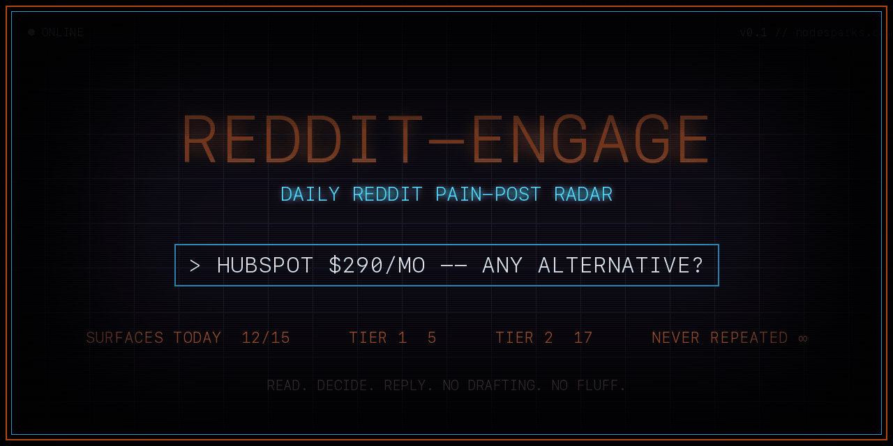
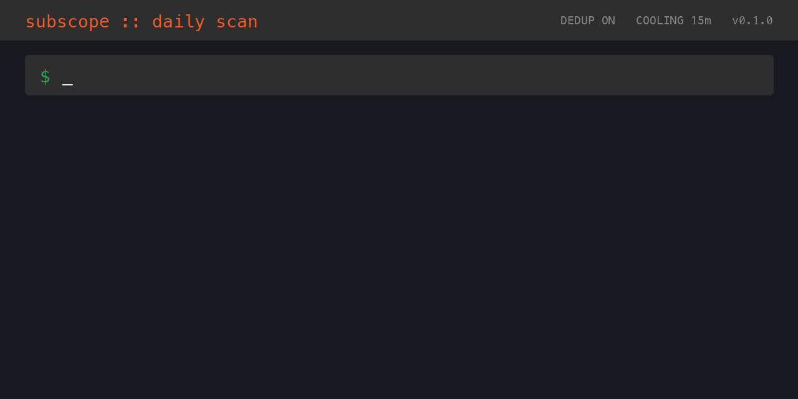

<div align="center">

# subscope



**subscope reads Reddit for you and finds threads where someone is actively shopping for what you sell.**

Run it whenever you want. Each scan returns ~10 of the strongest threads directly in your Claude Code chat. Things like "Apollo renewal hike, what's the alternative?" or "switching from HubSpot, recommendations?". You read them, decide which deserve a reply, and write the comment yourself on Reddit. Free. No API keys. Runs inside Claude Code.

```bash
/plugin install dancolta/subscope
/subscope:onboard       # 3 questions, 60s
/subscope:run           # your first scan
```

</div>

---

## Who this is for

### 🧱 B2B SaaS founder
_Project management, analytics, productivity, HR, anything per-seat._

At 11am someone posts in r/SaaS: *"30-person team, Notion is a mess, what's next?"* That thread will have 80 replies by tomorrow. You want to be in it at reply 5, not reply 95. subscope drops it into your chat while the OP is still in the comments reading.

### 📈 Sales or marketing tool
_CRM, outreach, automation._

A sales ops manager opens their inbox to a 40% Apollo renewal hike, posts in r/sales: *"Apollo just hiked us 40%, who's everyone moving to?"* Within hours that thread is a vendor pile-on. subscope catches it before the OP starts booking demos, the small window where one good comment changes the shortlist.

### 🛠️ Agency or freelance practice
_Marketing, RevOps, dev work._

This one is incoming demand, not competitor defection. Someone posts in r/Entrepreneur: *"Need a freelance Webflow dev who actually knows e-commerce, 4 weeks part-time."* The OP will get 8 generic pitches by end of day. subscope hands you the brief while you still have time to write something that is not a copy of the previous reply.

### 🧑‍💻 Developer tool
_API, framework, infra._

An engineer posts in r/devops: *"Anyone moved off Temporal at scale? Looking for something lighter."* They are in discovery, comparing alternatives, reading docs. subscope catches the thread during the part where you can shape what they evaluate, not the part where they are justifying a tool they already picked.

---

## The 8 signals it catches

Each pattern has its own scoring path. A `pricing-rage` thread and an `alternative-seeking` thread rank separately because they are different buying moments.

| Pattern | What it captures |
|---|---|
| `pricing-rage` | Public anger about a renewal hike |
| `churn` | "Looking to ditch X for..." threads |
| `build-vs-buy` | Debates with actual numbers attached |
| `rfp-bait` | A vs B vs C comparison threads |
| `stack-audit` | "Help me cut tools from my stack" posts |
| `alternative-seeking` | Explicit "alternative to X?" threads |
| `resurrect` | Quality threads aged 6 to 18 months still getting traffic |
| `rivals` | Any mention of a brand in your competitive set |

---

## What you do day to day

| Command | What it does |
|---|---|
| `/subscope:run` | Manual scan, top ~10 threads land in chat with pattern badges |
| `/subscope:judge <n>` | Deeper read on a single thread, returns intent and a reply angle |
| `/subscope:tune` | Mark surfaces good/bad/meh, the ranker adjusts to your niche |
| `/subscope:postmortem` | Auto-tracks the replies you actually send on Reddit, scores them 7 days later (upvotes, follow-ups, removal status), feeds that back into next week's rankings |

**The tool gets sharper for your specific niche the longer you use it, because it learns from what actually worked.**

---

## How it works



**The setup is where the targeting actually happens.** `/subscope:profile` runs a deep 8-question interview (~12 minutes) that produces a real targeting profile:

- **ICP definition** — who you want to reach, what role, what stage of buying
- **Competitor anchor list** — the brands your buyer is churning from, comparing you against, or rage-quitting
- **Pain language** — the actual phrases buyers use, extracted from your homepage and the interview, not generic SEO keywords
- **Subreddit tiers** — bullseye subs scanned on every run (Tier 1) vs opportunistic subs where only standouts surface (Tier 2)
- **Few-shot example posts** — sample threads the LLM grader uses to recognize what a real buying moment looks like in your category

Those become four config files at `~/.config/subscope/` (subreddits, keywords, brand-anchor, example-pains). Every scan reads them. This is the actual product differentiator: the profile is built specifically for you, not pulled from a generic SaaS-founder template.

Don't have 12 minutes on day 1? `/subscope:onboard` is a 3-question quick version (~60 seconds) that uses 6 built-in archetypes plus your homepage URL to bootstrap the same four config files. Same shape, less precision. Upgrade to `/subscope:profile` whenever you want without losing your existing config.

Once your profile is in place, each scan fetches new posts from your configured subs, filters throwaway accounts before scoring, and ranks what's left by signal strength: freshness, upvote velocity, comment velocity, keyword density, and which of 8 buying-intent patterns the post matches. Tier 1 surfaces every run. Tier 2 surfaces only when a standout appears.

---

## Integrations

subscope slots into the tools you already use.

| Integration | Why | Setup |
|---|---|---|
| Reddit OAuth | Recommended. 10x rate budget, enables postmortem reply tracking | Free script app at reddit.com/prefs/apps |
| Bulk LLM grading | Optional. Grade posts at scale via any of 5 providers | One API key in setup wizard |
| Notion daily triage DB | Optional. 14-column triage schema with OP score | ~5 min |
| Slack daily push | Optional. Formatted morning digest to your channel | Paste one webhook URL |
| Obsidian weekly digest | Optional. Weekly pulse via `/subscope:pulse` | Vault path in config |

**Supported LLM providers for bulk grading:** Anthropic, OpenAI, Groq, OpenRouter, Ollama. Provider is auto-detected from your key prefix. Without a key, the regex gate runs alone and `/subscope:judge` handles ad-hoc grading at no extra cost.

---

<details>
<summary>All 16 skills</summary>

The 4 core skills above plus 12 pattern-scan and utility skills:

`/subscope:onboard` `/subscope:profile` `/subscope:setup` `/subscope:pulse`
`/subscope:pricing-rage` `/subscope:churn` `/subscope:build-vs-buy` `/subscope:rfp-bait`
`/subscope:stack-audit` `/subscope:alternative-seeking` `/subscope:resurrect` `/subscope:rivals`

Each pattern skill runs `fetch-score --mode <pattern>` so you can scan a single intent class on demand. All 16 listed in [`skills/`](skills/).

</details>

---

## Setup

Run `/subscope:setup`. The wizard presents each optional layer. Skip any of them and the default runs without it. Runs on day 1 with zero API keys.

Need more than 10 results per run? `--max-surfaces N` raises the cap.

Config lives at `~/.config/subscope/`. Every file is written with `chmod 600`.

---

## Privacy

- All data is local. SQLite at `~/.local/share/subscope/subscope.sqlite`, config at `~/.config/subscope/`. Both `0o600`.
- Reddit OAuth credentials are written atomically so the file is never world-readable at any point during creation.
- When bulk LLM grading is enabled, post bodies (capped at 800 chars) go to your configured endpoint. A one-time notice appears the first time. Zero telemetry otherwise.

---

You find the thread. You write the reply. subscope handles the part that would take you an hour every morning.

MIT. See [LICENSE](LICENSE).
